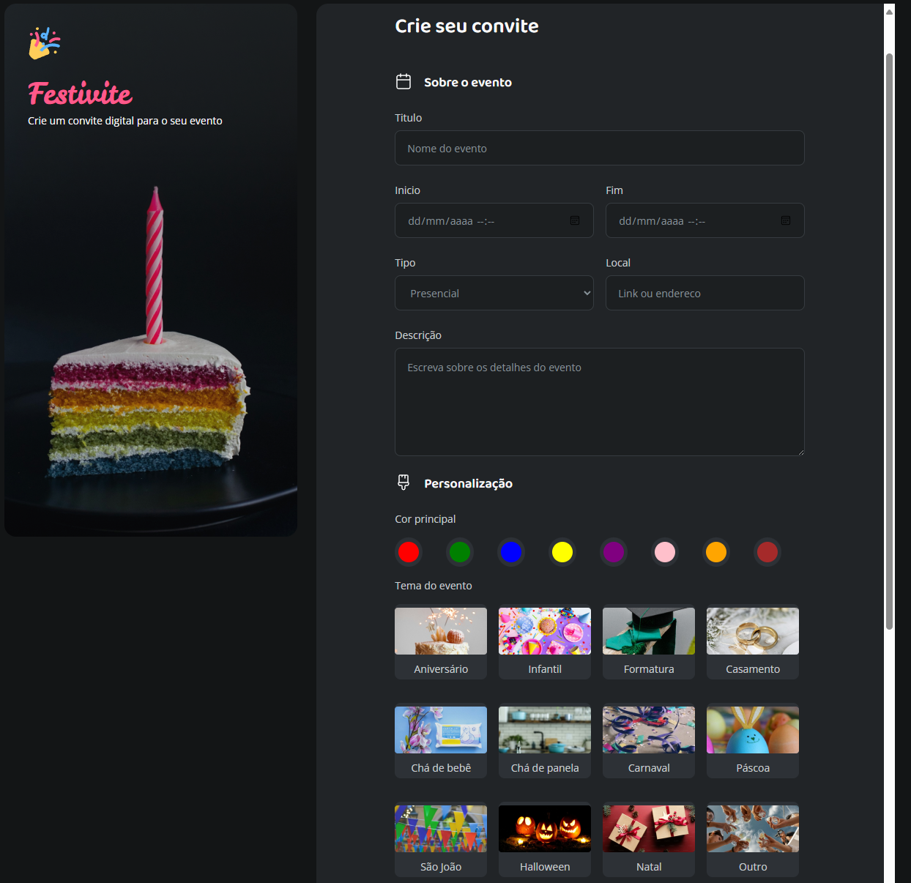

<!-- @format -->

````markdown
# Formulário de Convite

## Descrição

Este projeto é um formulário de convite digital que permite aos usuários criar convites personalizados para eventos.



## Tecnologias Utilizadas

- HTML
- CSS

## Estrutura do Projeto

- `index.html`: Arquivo principal do formulário.
- `styles/`: Diretório contendo os arquivos CSS.
- `assets/`: Diretório contendo imagens e ícones.
- `scripts/`: Diretório contendo arquivos JavaScript (se houver).

## Instalação

1. Clone o repositório:
   ```bash
   git clone https://github.com/rbbaptista/formulario-de-convite.git
   ```
````
